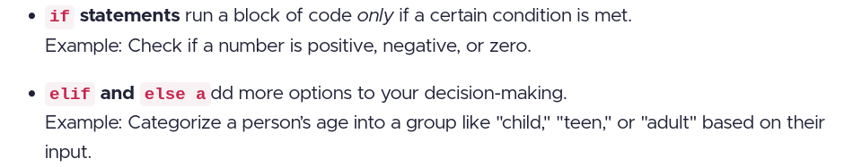

# small typo

July 19th -
    So far so good. The material is very concise and digestable, I really appreciate the code examples and use cases.
    The loop practice patterns chapter in section 2 is very useful.
    I also didnt know about the "continue" and "pass" key words in python up until now, very important.
    As I'm completing the chapter I found the "best practices" chapters in section 3 & 4 very informative as well.

# repeating/duplicate lab
the simple interest lab from module 1 is included in module 2.